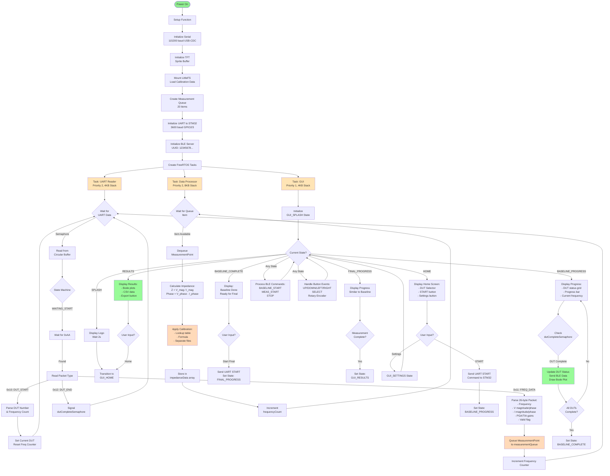
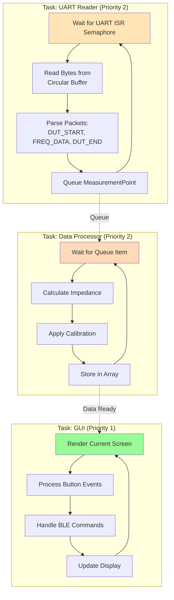
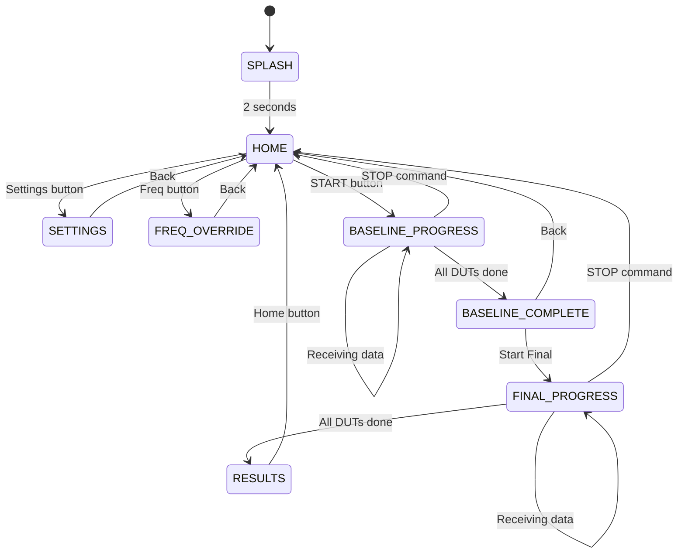
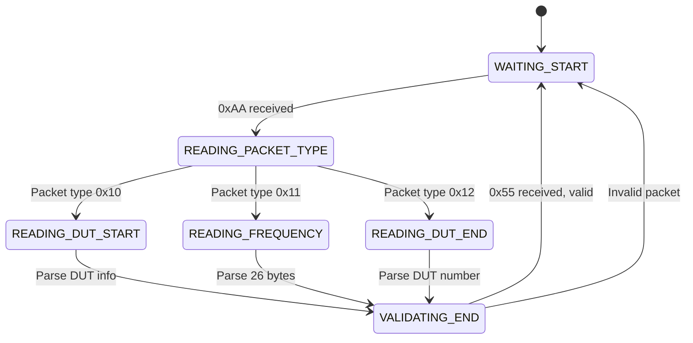

# BioPal ESP32 Firmware Flow Diagram

## Detailed Program Flow

This diagram shows the complete execution flow with all three FreeRTOS tasks and their interactions.



---

## Simplified Flow Diagram (For Reports)

This simplified horizontal diagram shows the overall system flow suitable for presentations and reports.

```mermaid
graph LR
    Start([System Start]) --> Init[Initialize<br/>Hardware & Load<br/>Calibration Data]
    Init --> Home[Display<br/>Home Screen<br/>Select DUTs]

    Home -->|User/BLE START| SendCmd[Send START<br/>Command to STM32<br/>via UART]

    SendCmd --> Loop{For Each DUT}

    Loop --> Receive[Receive Measurement<br/>Data from STM32]

    Receive --> Process[Calculate<br/>Impedance<br/>Z = V/I]

    Process --> Calibrate[Apply<br/>Calibration<br/>Corrections]

    Calibrate --> Display[Update Display<br/>Progress Bar]

    Display --> BLE[Transmit Results<br/>via BLE & Serial for debugging]

    BLE -->|More DUTs| Loop
    BLE -->|Complete| Results[Show Results<br/>Screen with<br/>Final Data]

    Results --> Home

    style Start fill:#90EE90
    style Init fill:#FFE4B5
    style Home fill:#87CEEB
    style SendCmd fill:#FFD700
    style Receive fill:#FFD700
    style Process fill:#FFDAB9
    style Calibrate fill:#FFDAB9
    style Display fill:#98FB98
    style BLE fill:#98FB98
    style Results fill:#90EE90
```



### Simplified Flow Explanation

1. **Initialization**: Setup hardware, load calibration data from flash
2. **Home Screen**: User selects number of DUTs (1-4) and presses START
3. **Send Command**: ESP32 sends START command to STM32 via UART (3600 baud)
4. **Data Reception Loop** (for each DUT):
   - Receive 38 frequency measurements from STM32
   - Each measurement contains voltage/current magnitude and phase
5. **Impedance Calculation**: Z = V_magnitude / I_magnitude
6. **Calibration**: Apply calibration corrections from lookup table or formula
7. **Display Update**: Show progress bar, DUT status, and real-time Bode plot
8. **BLE Transmission**: Send results to connected mobile/web app
9. **Results Screen**: Display final impedance data and Bode plots
10. **Export**: Save data as CSV via USB serial

**Total Time per Measurement**: ~42 seconds per DUT (controlled by STM32)

---

## FreeRTOS Task Architecture

The system uses three concurrent tasks running in parallel:



### Task Communication

- **UART ISR → UART Reader**: Semaphore signals data available in circular buffer
- **UART Reader → Data Processor**: Queue containing MeasurementPoint structures
- **Data Processor → GUI**: Shared memory arrays (impedanceData) with atomic counters
- **GUI ← User/BLE**: Button events and BLE command strings trigger state changes

---

## State Machine Diagram

### GUI State Machine



### UART Receiver State Machine



---

## Data Flow Diagram

```
┌──────────────────────────────────────────────────────────────┐
│                         STM32 Board                          │
│     (Generates sine waves, measures V & I via ADC/FFT)       │
└────────────────────┬─────────────────────────────────────────┘
                     │ UART @ 3600 baud
                     │ Binary packets
                     ▼
┌──────────────────────────────────────────────────────────────┐
│                      ESP32-C6 Board                          │
│  ┌────────────────────────────────────────────────────────┐  │
│  │ UART ISR → Circular Buffer (512 bytes)                 │  │
│  └────────────────────┬───────────────────────────────────┘  │
│                       │ Semaphore                             │
│                       ▼                                       │
│  ┌────────────────────────────────────────────────────────┐  │
│  │ Task: UART Reader (Parse packets)                      │  │
│  │  - DUT_START: Set current DUT                          │  │
│  │  - FREQ_DATA: Extract V, I, phase, gains              │  │
│  │  - DUT_END: Signal completion                          │  │
│  └────────────────────┬───────────────────────────────────┘  │
│                       │ Queue (MeasurementPoint)              │
│                       ▼                                       │
│  ┌────────────────────────────────────────────────────────┐  │
│  │ Task: Data Processor                                   │  │
│  │  1. Z = V_magnitude / I_magnitude                      │  │
│  │  2. Load calibration coefficients                      │  │
│  │  3. Calibrated_Z = Z_raw / calibration_gain           │  │
│  │  4. Store in impedanceData[DUT][freq]                 │  │
│  └────────────────────┬───────────────────────────────────┘  │
│                       │ Shared Array                          │
│                       ▼                                       │
│  ┌────────────────────────────────────────────────────────┐  │
│  │ Task: GUI                                              │  │
│  │  - Render progress screen & Bode plots                │  │
│  │  - Handle button/encoder input                        │  │
│  │  - Process BLE commands                               │  │
│  │  - Send BLE/Serial data                               │  │
│  └────────────────────┬───────────────────────────────────┘  │
│                       │                                       │
│                       ├─────> TFT Display (320×240)          │
│                       ├─────> BLE (Mobile App)               │
│                       └─────> USB Serial (CSV Export)        │
└──────────────────────────────────────────────────────────────┘
```

---

## Timing Summary

| Phase | Duration | Notes |
|-------|----------|-------|
| System Initialization | ~2 seconds | Load calibration, setup BLE/UART |
| Splash Screen | 2 seconds | Display logo |
| User Selection | Variable | Wait for user to select DUTs and press START |
| STM32 Measurement | ~42s per DUT | STM32 controls timing (1s settle + measurements) |
| Data Processing | <10ms per frequency | ESP32 calculation and calibration |
| BLE Transmission | ~2s per DUT | Send JSON data to mobile app |
| Display Update | 16-33ms | GUI refresh rate (30-60 FPS) |
| **Total for 4 DUTs** | **~3 minutes** | End-to-end measurement cycle |

---

## Key Design Features

1. **Non-blocking Architecture**: FreeRTOS tasks ensure responsive UI during measurements
2. **Interrupt-driven UART**: ISR fills buffer, task processes (no polling overhead)
3. **Queue-based Processing**: Loose coupling between UART reception and data processing
4. **Double-buffered Display**: Sprite system eliminates flicker
5. **Real-time Progress**: UI updates as each frequency point completes
6. **Wireless Control**: BLE commands allow headless operation from mobile app
7. **Flexible Calibration**: Multiple calibration modes support different accuracy requirements
